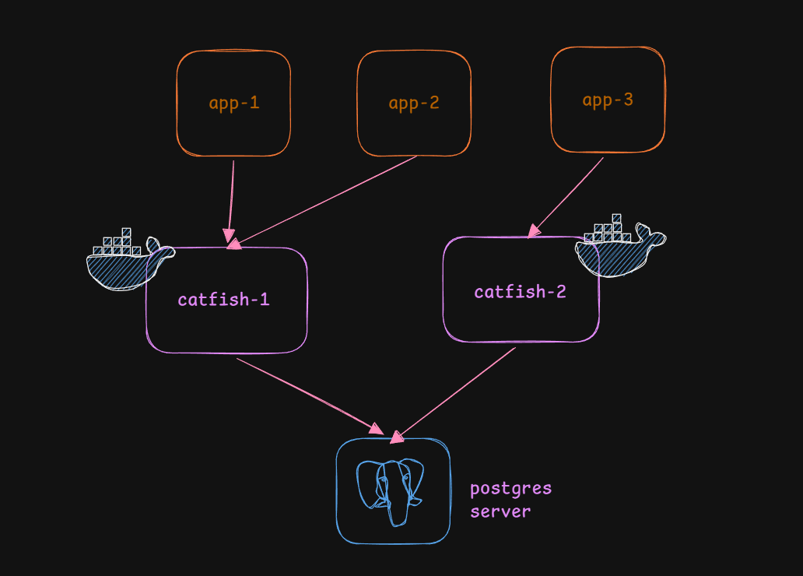

# catfish

> A priority-aware Postgres connection pooler. No, it's not a PgBouncer killer.

[](https://go.dev)
[](LICENSE)

---

## Why "Catfish"?

Connection poolers are kind of like catfish accounts — they give your app a lavish view of what is mostly a simpler, not-so-grand thing. Your app believes there are many open, free connections to acquire. The reality is different: Postgres connections are expensive, you can't have many of them, and constantly closing and reopening them wastes server resources. So instead, a smaller number of connections are recycled across a large number of application requests. The pooler is the catfish.

---

## What is this?

PgBouncer is great. Seriously — use it for most things. But it has a few blind spots:

- **No priority awareness.** When the pool fills up, PgBouncer doesn't care if the waiting query is a critical payment flow or an analytics scan running at 3am. Everything gets the same flat queue.
- **Single-threaded.** One thread handles all connection assignment. Fine for smaller workloads, but a meaningful bottleneck under high concurrency.
- **No load shedding.** Cancelled or expired queries sit in the queue, blocking newer requests behind them. By the time those stale queries are discovered and removed, the newer ones may have already expired too.

**Catfish fixes that.**

Catfish is a proxy server that sits between your app and Postgres. It assigns connections based on *priority tiers* with configurable weights — so your critical queries always get served before the low-priority ones. Each client is handled in its own goroutine, overcoming the single-threaded bottleneck. And when things are busy, queries that do wait are managed by a **CoDel (Controlled Delay)**-based queue that prevents buffer bloat and keeps latency predictable.

The design is heavily inspired by PGKeeper, an internal tool built at Figma. You can read about the implementation in [this blog post](#) and the original PGKeeper writeup [here](#https://www.figma.com/blog/pgkeeper-building-the-bouncer-we-needed-for-postgres/).

<p align="center">
  
</p>

---

## How it works

### Priority tiers + weighted semaphore

You define tiers (e.g. `critical`, `normal`, `low`) and assign each a weight. Catfish uses a **prioritized semaphore** with a total concurrency cap (`max_concurrent`). When a slot opens up, it's awarded to the tier with the highest relative weight. A critical query at weight 3 gets picked 3x more often than a low-priority one at weight 1.

Each user in the config is assigned to a tier — so `admin_user` might be `critical` while `analytics_user` is `normal`.

#### Debt-based reservation

The semaphore also implements a self-adjusting **debt** mechanism. If a higher-priority query had to wait because lower-priority ones were occupying slots, the semaphore increases the debt on the lower-priority tiers — effectively reserving slots for the higher-priority queue. The reverse is also true: if critical queries were served without any wait at all, debt is decreased to avoid over-reserving.

Debt is forgiven entirely every 10 seconds. Given a queue size of ~200 and ~10ms per query, it takes around 6 seconds for a completely new batch of queries to fill the queues. A new pattern of requests means the previously learned debt is no longer relevant, so it's wiped.

### CoDel queue

When no slot is immediately available, queries don't just spin or get rejected — they wait in a **CoDel-based queue**. CoDel (Controlled Delay) is a queue management algorithm originally designed for network packets. Rather than shedding load based on queue depth, it sheds based on *how long requests have been waiting*.

Under heavy load, CoDel switches the queue from **FIFO to LIFO** order. This avoids the failure mode where the pool grinds through a backlog of already-expired requests before reaching the live ones at the back. When load drops, it switches back to FIFO. A background `reap()` periodically removes stale requests from the queue, and reap timeouts are more aggressive in LIFO mode.

To handle the race condition where a request is cancelled by the client at the exact moment the semaphore admits it, each waiting request is wrapped in a `coDelWaiter` struct with an atomic state variable. Whichever side wins the atomic swap — admission or cancellation — determines what actually happens. The query is never both executed and reported as dropped.

### Connection pools

Catfish creates one backend connection pool per `(username, database)` pair. Pools can be tuned globally or overridden per user. The pool handles connection lifetime, idle eviction, and minimum warm connections so you're not cold-starting on the first request.

#### Connection hygiene on recycle

Connections are never closed between queries — they're recycled. Before a released connection is returned to the pool, Catfish runs cleanup automatically via `pgx`'s `AfterRelease` hook:

- If the previous query left an **unfinished transaction** (neither committed nor rolled back), it issues a `ROLLBACK`.
- If the previous query left **unread rows**, it drains them.

This ensures the next user of that connection doesn't accidentally read leftover results from a previous query.

#### No direct `Acquire()`

The pool deliberately does not expose a `Pool.Acquire()` method to callers. If it did, callers could bypass the backpressure layer and run queries directly without going through the semaphore. All queries must pass through the proxy, which enforces priority and load management.


## Getting started

### Prerequisites

- Go 1.21+
- A running Postgres instance
- A YAML config file (see below)

### Run directly

```bash
go run ./cmd -config ./config.yml
```

### Build and run

```bash
go build -o catfish ./cmd
./catfish -config ./config.yml
```

### Windows

```powershell
go build -o catfish.exe ./cmd
.\catfish.exe -config .\config.yml
```

---

## Configuration

Catfish is configured entirely through a YAML file. Here's a full example:

```yaml
listen: ":6432"
postgres_host: "localhost"
postgres_port: 5432
shutdown_timeout: 10s
max_concurrent: 100

pool:
  min_conns: 5
  max_conns: 25
  max_conn_time: 1h
  max_idle_time: 20m

tiers:
  - name: critical
    weight: 3
    queue_size: 500
  - name: normal
    weight: 2
    queue_size: 200
  - name: low
    weight: 1
    queue_size: 100

users:
  - username: admin_user
    database: products
    tier: critical
    password_env: CATFISH_ADMIN_USER_PASSWORD
    auth_method: scram-sha-256

  - username: analytics_user
    database: products
    tier: normal
    password_env: CATFISH_ANALYTICS_USER_PASSWORD
    auth_method: md5
    pool:
      min_conns: 2
      max_conns: 10
```

Passwords **never** go in the config file — they come from environment variables:

```bash
export CATFISH_ADMIN_USER_PASSWORD='supersecret'
export CATFISH_ANALYTICS_USER_PASSWORD='alsosecret'
```

If an env var is missing at startup, catfish fails on purpose. No silent defaults on credentials.

### Top-level fields

| Field | Default | Description |
|---|---|---|
| `listen` | `:6432` | Address catfish listens on |
| `postgres_host` | *(required)* | Postgres backend host |
| `postgres_port` | `5432` | Postgres backend port |
| `shutdown_timeout` | `10s` | Grace period for in-flight queries on shutdown |
| `max_concurrent` | *(required)* | Total concurrent query slots across all tiers |

### Pool fields (global and per-user)

| Field | Default | Description |
|---|---|---|
| `min_conns` | `5` | Minimum idle connections to keep warm |
| `max_conns` | `25` | Maximum connections per pool |
| `max_conn_time` | `1h` | Max lifetime of a connection |
| `max_idle_time` | `20m` | Max idle time before a connection is evicted |

### Tier fields

| Field | Default | Description |
|---|---|---|
| `name` | *(required)* | Tier identifier — referenced by users |
| `weight` | `1` | Relative priority weight |
| `queue_size` | `200` | Max requests waiting in this tier's queue |

> **Order matters.** List tiers from highest to lowest priority in the YAML.

### User fields

| Field | Default | Description |
|---|---|---|
| `username` | *(required)* | Postgres username to accept |
| `database` | *(required)* | Database this user is allowed to connect to |
| `tier` | *(required)* | Which tier this user belongs to |
| `password_env` | *(required)* | Env var name holding the password |
| `auth_method` | `scram-sha-256` | One of `scram-sha-256`, `md5`, `cleartext` |
| `pool` | *(inherits global)* | Per-user pool overrides |

---

## Things to know

- **It's a service, not a library.** You run catfish as a sidecar/process. You don't import it.
- **One pool per (username, database) pair.** Two users on different databases get separate pools even if they share a username.
- **Tiers are not suggestions.** Weights directly affect how the semaphore hands out slots. Assign them thoughtfully.
- **Startup warms the pools.** Catfish connects to Postgres on boot. If Postgres is down, catfish won't start.
- **Each client gets its own goroutine.** Unlike PgBouncer's single-threaded model, Catfish handles each connected client independently and concurrently.
- **No SSL from clients (yet).** Catfish declines TLS during the client handshake. Plain Postgres protocol only.
- **Unknown users are rejected.** If a client connects with a username/database pair not in your config, it gets an auth error. No fallthrough.
- **No support for `transaction` and `statement` pooling modes.**
- **All queries carry equal weight.** Each query occupies exactly one concurrency token regardless of query complexity. A future improvement could use a lightweight model to assign per-query weights.

---

## Authentication

Catfish handles client authentication itself (rather than delegating to `pg_hba.conf`). This is necessary because pools are created at startup for a fixed set of known users — dynamic connections aren't supported. Three authentication methods are implemented:

- `scram-sha-256` (default, recommended)
- `md5`
- `cleartext`

SSL authentication is not currently supported.

---

## Project structure

```
catfish/
├── cmd/             # Binary entrypoint
├── backpressure/    # CoDel queue + prioritized semaphore
├── config/          # YAML parsing and validation
├── pool/            # Backend connection pool management
├── proxy/           # Client auth, protocol handling, query routing
└── utils/deque/     # Lock-free deque used by the queue
```

---

## Comparison with PgBouncer

| Feature | PgBouncer | catfish |
|---|---|---|
| Connection pooling | ✅ | ✅ |
| Priority tiers | ❌ | ✅ |
| CoDel queue management | ❌ | ✅ |
| Debt-based slot reservation | ❌ | ✅ |
| Per-user pool config | ✅ | ✅ |
| Multi-threaded client handling | ❌ | ✅ |
| SSL client support | ✅ | ❌ (not yet) |
| Maturity / production use | Very high | Experimental |
| Written in | C | Go |

> Catfish is a fun little side project — not yet a production PgBouncer replacement. PgBouncer has years of battle-testing. Use catfish if you need priority-aware pooling and are okay with the tradeoffs.

---

## Roadmap / ideas

- [ ] SSL/TLS support for client connections
- [ ] Metrics endpoint (`/metrics`)
- [ ] Hot config reload without restart
- [ ] Admin interface for live pool stats
- [ ] Per-tier latency and queue depth monitoring
- [ ] Per-query weight assignment (e.g. via a lightweight classifier)

---

## Credits

- [PGKeeper blog post by Figma](https://www.figma.com/blog/postgres-connection-pooling/) — the primary design inspiration
- [jackc/pgx](https://github.com/jackc/pgx) — the Postgres driver and protocol library underlying everything
- The `bradenaw/backpressure` package whose implementation helped inform the semaphore and CoDel design

---

## Contributing

PRs and issues are welcome. If something's broken or the docs are confusing, open an issue. SSL support and a metrics endpoint are the two areas most in need of help.

```bash
git clone https://github.com/DivyanshuShekhar55/catfish
cd catfish
go test ./...
```

---

## License

MIT. See [LICENSE](LICENSE).